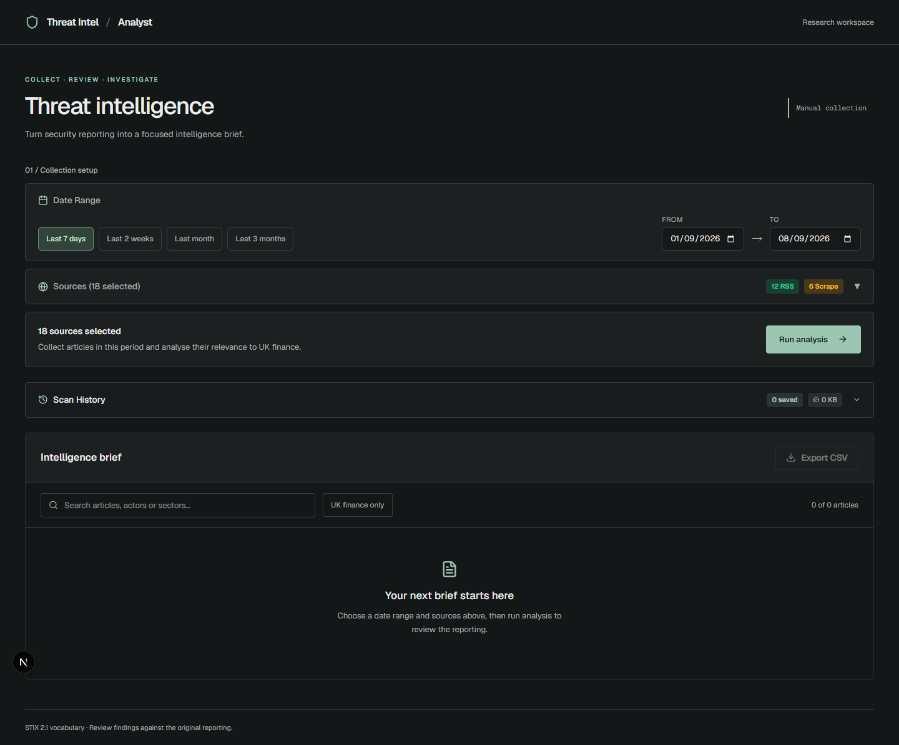
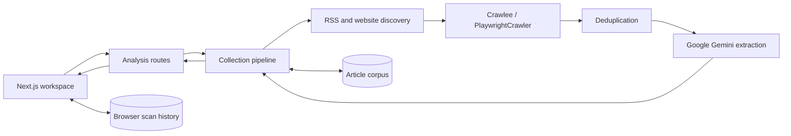

# Threat Intel Analyst

**A research workspace for turning security reporting into structured threat intelligence.**

Threat Intel Analyst collects articles from RSS feeds and security news sites, extracts threat details with Google Gemini, and brings the results into a searchable brief. It is built around reviewing relevance to UK financial services, with links back to the original reporting.

**Status: development application.** Collection, streaming analysis, local persistence and exports are implemented. Findings are model-generated and require analyst review.



*Actual application interface before a collection. No live findings or sample results are shown.*

## What it does

- **Source selection:** choose configured publishers, test article discovery, and switch supported sources between RSS and website scraping.
- **Date-based collection:** collect reporting for a preset or custom date range, with progress messages during analysis.
- **Structured extraction:** identify target country, sector, actor type, named actors, attack patterns and relevance to UK finance. Sector and actor fields use STIX 2.1 vocabulary.
- **Review and export:** search findings, filter for UK finance relevance, sort results, and export the current filtered and sorted view as CSV.
- **Saved scans:** reopen, rename, delete or export completed scans as JSON in the same browser.
- **Reusable article corpus:** retain article content and prompt-versioned analyses in SQLite so later collections can reuse earlier work.

## Run locally

Use **Node.js 22 or newer**, npm, and a Google Gemini API key. SQLite is a native dependency; if a matching prebuilt binary is unavailable, installation requires platform C++ build tools and a compatible SDK.

```bash
git clone https://github.com/EthanChamps/threat-intel.git
cd threat-intel
npm ci
npx playwright install chromium
```

Create `.env.local` in the repository root and set `GOOGLE_GENERATIVE_AI_API_KEY` to your key from [Google AI Studio](https://aistudio.google.com/apikey). The pipeline currently selects `gemini-2.0-flash` in `lib/corpus-analysis.ts`; your account must support the configured model.

```bash
npm run dev
```

Open [localhost:3000](http://localhost:3000). The interface can be explored without a key; live AI analysis requires credentials and network access.

1. Choose a date range and expand **Sources** to adjust the selection.
2. Optionally use **Test Selected** to check discovery before analysis.
3. Select **Run analysis** and follow the activity log.
4. Review the brief, narrow it with search or the UK finance filter, and open original articles to verify findings.
5. Export results as CSV, or use **Scan History** to reopen and export completed scans.

## Architecture



| Area | Location |
| --- | --- |
| Workspace and application shell | `app/page.tsx`, `app/layout.tsx` |
| Source, date, history and results controls | `components/` |
| Streaming and non-streaming analysis | `app/api/analyze-stream/`, `app/api/analyze-feed/` |
| Collection and reuse logic | `lib/corpus-analysis.ts` |
| Extraction schema and system prompt | `lib/extractor.ts` |
| Discovery, scraping and deduplication | `lib/fetcher.ts`, `lib/scraper.ts`, `lib/source-crawler.ts`, `lib/crawler.ts`, `lib/deduplicator.ts` |
| Article persistence and browser history | `lib/article-store.ts`, `lib/scans.ts` |

The app uses Next.js 16, React 19, the Vercel AI SDK, TanStack Table, Crawlee and SQLite. Keep both analysis endpoints consistent when changing pipeline behaviour.

## Crawling

[Crawlee](https://github.com/apify/crawlee) manages Chromium navigation, request queues, retries and browser pools through `PlaywrightCrawler`. No Apify account, token or hosted service is required. RSS feeds remain parsed with `rss-parser`; Cheerio extracts article text from rendered pages.

- Listing pages are processed sequentially. Article pages use up to three concurrent requests, with two retries for failed requests and bounded session rotations.
- Each crawl has an isolated in-memory queue. The SQLite corpus remains the persistent store; Crawlee does not create a second article database.
- Source selectors, pagination patterns, date filtering and load-more behaviour remain application-specific. Discovery defaults to one listing page (configurable with `maxPages`, capped at 50) and up to ten load-more clicks. Scrolling is bounded as well.
- Browser pools are closed after each crawl, including errors. One failed source cannot close another request's browser.
- Chromium must be installed with `npx playwright install chromium`, including after Playwright upgrades. Crawling requires a Node.js server that supports launching browsers.

## Data and storage

**Browser storage** holds source preferences and completed scan history. These are specific to the browser and origin; clearing browser data removes them. Export important scans as JSON before clearing storage.

**Server-side SQLite** holds article metadata, scraped content, source relationships and cached analyses at `data/threat-intel.sqlite`. It is created on first collection and database files are ignored by Git. Stop the server before copying the database for a simple backup; a live backup must account for SQLite WAL state.

Article content is sent to Google for analysis. Keeping a local corpus does not make inference local. API keys belong in `.env.local` and must never be committed.

## Development

| Command | Purpose |
| --- | --- |
| `npm run dev` | Start the development server |
| `npm run lint` | Check ESLint rules |
| `npm run build` | Create a production build and check TypeScript |
| `npm start` | Serve the production build |
| `npm run verify:crawler` | Exercise Crawlee against local fixture pages with real Chromium |

Run lint and build after changes, then manually verify affected flows. The crawler verification script checks pagination, load-more interaction, dates, duplicate URLs, retries, failures, concurrent queue isolation and RSS compatibility without external sites or model credentials. It uses real Chromium and is not a `playwright test` suite.

## Limitations

- Source availability, publication dates and website layouts affect coverage. A selected range does not guarantee every article will be discovered.
- Model output may be incomplete or incorrect. UK finance relevance is a model judgement; using STIX vocabulary does not make the export a STIX bundle.
- Scraping and model requests can fail or hit provider limits. Inspect the activity log for partial results and errors.
- Stopping analysis disconnects the browser request; it does not guarantee cancellation of work already running on the server.
- Browser history has finite storage capacity. The SQLite corpus requires a writable, persistent server filesystem.
- Authentication and multi-user isolation are not implemented. Evaluate locally; shared hosting requires additional access controls and storage planning.
